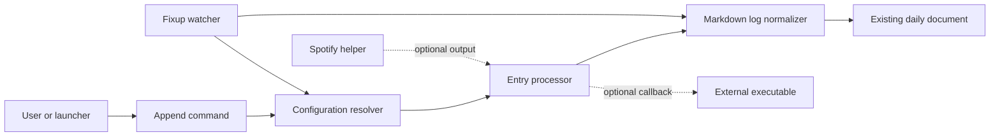

# dlog specification

## Purpose and compatibility target

This document specifies a portable reimplementation of **dlog**, a local command-line utility that turns one short text input into a formatted entry in today's existing daily-log document. It deliberately specifies behavior, data contracts, and operational semantics rather than an implementation language or configuration syntax.

The target is **observable compatibility** with the current program. When existing prose documentation, an assertion, and running behavior disagree, preserve the running behavior described here. In particular, retain the parser's normalizing and terminal-newline behavior rather than inferring a more conventional Markdown writer.

### Scope

A compatible implementation includes:

1. The interactive and argument-based append command.
2. Configuration discovery, the portable configuration model, substitutions, callbacks, and external-tool support.
3. The daily-document parser and normalizer.
4. The one-shot and watch-mode fixup command.
5. The supplied optional Spotify current-track utility and container deployment behavior.

It does **not** need to accept the current executable configuration-file syntax. Use a portable configuration representation appropriate to the target platform, but preserve the semantics and callback contracts below. A legacy configuration adapter is optional and outside this specification.

### TypeScript implementation profile

This repository implements scope items 1 through 4. It does not bundle the
optional Spotify helper, container image, direct clipboard integration, or a
legacy Ruby configuration adapter. Existing standalone helpers remain usable
through executable plugins.

The implementation uses versioned TOML configuration, strftime templates for
daily paths and entry prefixes, and explicit executable argument arrays. These
choices are normative for this repository where they differ from the portable
Ruby-derived contract below.

## Terminology

- **Entry text**: The user's text after timestamp-prefix extraction and substitutions, before the entry-prefix formatter runs.
- **Rendered entry**: The entry-prefix output concatenated with entry text. This is the string persisted in the log section.
- **Daily document**: An existing plain-text document selected by `dailyLogFinder` for a local calendar day.
- **Standard entry**: A line that matches `^(- \[ \] )?- \*\d\d:\d\d\* -\s`. The writer retains only standard entries in the target section.
- **Blank**: Empty or whitespace-only text.
- **Local time**: The machine's current local date, time, and time zone. The application has no clock or time-zone command-line setting.

## System boundary



The application is entirely local except for optional external executables such as the Spotify helper. It neither creates daily documents nor synchronizes them.

## Public command contracts

The TypeScript CLI is one argv0-aware executable. `dlog` is a strict dispatcher
requiring `append` or `fixup`. Symlinks named `dlog-append` and `dlog-fixup`
infer the corresponding subcommand.

### Append command

The primary command accepts zero or more positional words.

1. With one or more words, join all words with single spaces to form the input.
2. With no words, write `Enter Log: ` to standard output, read one standard-input line, and trim it.
3. Locate and load configuration as described in [Configuration discovery](#configuration-discovery).
4. A blank input writes `No input, exiting` to standard error and exits with status `1`.
5. Process the input into a rendered entry.
6. If the rendered entry is blank, write `Entry was blank, exiting` to standard error and exit with status `2`.
7. Append and normalize today's daily document.
8. Write the rendered entry, without additional decoration, to standard output.

The normal success path does not expose a separate success status; standard process status `0` is expected. Configuration, vault, document, and callback failures propagate as errors rather than being converted to structured CLI error messages.

There is no option to select another date. Appending always uses the local current day.

### Fixup command

The secondary command normalizes the `# Log` section without adding an entry. It has two modes:

- **once** (default): Wait for the initial file state to stabilize, run one fixup, emit logs, and exit.
- **loop**: Continue monitoring the selected daily document and fix it after each stabilized change.

Its options are:

| Option                                | Meaning                                                                      | Default / bounds                                                     |
| ------------------------------------- | ---------------------------------------------------------------------------- | -------------------------------------------------------------------- |
| `-w`, `--watch`                       | Select loop mode.                                                            | Default is once mode.                                                |
| `-s`, `--sleep SECONDS`               | Poll interval in loop mode.                                                  | `5`; clamp to 1–3600 seconds.                                        |
| `-d`, `--delay SECONDS`               | Delay after a stabilized change before fixup.                                | `0` even after `--watch` selects loop mode; clamp to 0–3600 seconds. |
| `--log-no-change SECONDS`             | Minimum interval between no-change messages.                                 | `60`; negative values suppress those messages indefinitely.          |
| `--cache-config`, `--no-cache-config` | Reuse configuration within a local calendar day or reload it on each access. | Cache enabled.                                                       |

Use a monotonic clock for polling, throttling, and watchdog timers. Operational log messages go to standard error and begin with the local date-time in brackets.

## Configuration discovery

Evaluate these candidate paths in order and load the first readable file:

1. The path in the `DLOG_CONFIG` environment variable, if nonblank.
2. `~/.config/dlog/config.toml`.
3. `./dlog.toml`, relative to the current working directory.

Path expansion expands `~`, `$NAME`, and `${NAME}` in path-valued fields and
rejects references to unset variables. If no candidate is readable, fail with
an error that identifies `~/.config/dlog/config.toml` as the expected
configuration location.

The selected primary file must exist, be nonempty, and declare
`schema = "dlog-config/v1"`. Rule files declare
`schema = "dlog-rules/v1"`. The primary owns singleton application settings;
rule files own only includes, plugins, and processing rules.

### Required configuration model

| Field or operation | Contract                                                                                                                                                                                                                                    |
| ------------------ | ------------------------------------------------------------------------------------------------------------------------------------------------------------------------------------------------------------------------------------------- |
| `vaultRoots`       | Required ordered directory paths. Expand each path and select the first existing directory; reject the configuration if none qualify. The selected value is the runtime `vaultRoot`.                                                        |
| `dailyPath`        | Required strftime template evaluated with the local day. Resolve a relative result beneath `vaultRoot`; the returned path must exist and be a regular file.                                                                                 |
| `entryPrefix`      | Required strftime template. Its result precedes entry text exactly; an empty static string is allowed.                                                                                                                                      |
| `rules`            | One ordered, discriminated list containing prefix, global, wiki-link, and callback rules.                                                                                                                                                   |
| `includes`         | Optional rule files or directories. Resolve every relative path against the primary configuration parent, including nested includes. A directory loads its immediate non-hidden `*.toml` files lexically. Reject cycles and repeated files. |
| `enabled`          | Optional on includes, rule files, plugins, and rules; defaults to true. Disabled content is schema-validated but otherwise inert.                                                                                                           |
| `debugSink`        | Optional line-oriented output destination. Debug output is `[local time] message`.                                                                                                                                                          |

Reject duplicate prefix keys and duplicate global/wiki-link keys. The current program treats a global string and a global pattern as distinct only when the configuration representation considers those keys distinct; preserve that rule in the chosen portable format.

### Callback contract

A dynamic global substitution callback receives:

```text
replace(fullEntryBeforeThisRule, matchedText) -> string | no-change | empty-string
```

The callback is invoked once per match. `fullEntryBeforeThisRule` is the complete entry as it existed immediately before this rule began; it is not recomputed after earlier matches of the same rule. Return semantics are:

- **string**: replace that match with the string;
- **no-change** (for example, null): leave that match unchanged;
- **empty string**: delete that match.

The portable implementation may represent callbacks as named plugins, commands, expressions, or host-language functions. It must make their invocation and three return states unambiguous.

### Optional host helpers

For parity, configuration callbacks may need these operations:

- `dir(path) -> boolean`: expand the path and test whether it is a directory.
- Clipboard read and write: return trimmed clipboard text and replace clipboard text, respectively. These are host integrations, not required in a headless deployment.
- External-tool methods described next.

### External-tool contract

Dynamic callbacks can invoke a configured executable synchronously.

1. Setting a tool path clears prior output and sets its exit status to a nonzero sentinel.
2. A path containing `/` resolves as a path relative to the process working directory if it is not absolute. A bare name resolves through the process `PATH`.
3. Only executable files qualify. Cache both successful resolution and missing/nonexecutable results by the original requested name.
4. Running a missing tool is an error.
5. Invoke the resolved executable with an explicit ordered string array, capture
   standard output, trim it, and retain the numeric process exit status. No
   shell parses arguments, expands variables or globs, or implements pipelines
   and redirection.
6. `toolSuccess` is true only for status `0`; `toolError` is true for every other status. `toolOutput` returns the trimmed captured output.
7. An availability query reports whether a requested tool resolves to an executable file, using the same resolution cache.
8. The currently selected tool can be invoked again with a new argument array without being named again; doing so clears prior output and refreshes the exit status exactly as naming the tool again would.

This explicit-argv contract is a deliberate safety incompatibility with the
legacy shell-built raw argument string.

## Entry processing

### 1. Timestamp-prefix preprocessing

Start each entry with `timestamp = local now` and `text = input`.

#### Relative form

If input matches this form, process it first and return immediately from preprocessing:

```text
-<duration>|<optional whitespace><text>
```

`duration` consists only of digits, `h`, and `m`. Interpret these recognized forms as a duration in the past:

| Form   | Meaning                   |
| ------ | ------------------------- |
| `N`    | N minutes ago             |
| `Nm`   | N minutes ago             |
| `Nh`   | N hours ago               |
| `NhMm` | N hours and M minutes ago |

A syntactically accepted duration that matches none of those four forms subtracts zero. This follows the current implementation and should not be replaced with stricter validation in compatibility mode.

#### Absolute form

Otherwise, if input starts with exactly four digits, optionally contains a colon between the digit pairs, and then a pipe, consume it:

```text
HHMM|<optional whitespace><text>
HH:MM|<optional whitespace><text>
```

Interpret the four digits as a local clock time using the host date-time parser. The current behavior relies on that parser rather than independently validating hour and minute ranges.

#### Up-arrow shorthand

After absolute-prefix handling (or if neither timestamp form matched), replace a remaining text value exactly equal to `.` with the Unicode marker `⬆︎`. The relative branch returns before this rule, so `-5|.` remains `.` rather than becoming the marker.

If a caller supplies an explicit timestamp parameter and the input also carries either timestamp prefix, raise an error. The normal CLI does not supply an explicit timestamp; this rule exists for library-level callers and tests.

### 2. Ordered substitutions

Apply all prefix substitutions in registration order, then all global substitutions in registration order. Finally trim leading and trailing whitespace from entry text.

#### Prefix substitutions

A prefix key is a case-sensitive literal. It matches only this regular expression:

```text
^<escaped key>(\s|$)
```

The match consumes one following whitespace character when present. For a static replacement, append one trailing space at registration time unless the replacement already ends in a space. A dynamic replacement is not auto-spaced.

#### Global substitutions

A global string key is a case-sensitive literal replacement everywhere it occurs. A pattern key runs according to its pattern engine everywhere it matches. Each rule sees the output of prior rules.

A supplied phone-number helper is equivalent to this case-sensitive pattern:

```text
(?<!\d)(?:1[-.\s]?)?(?:\d{3}-\d{3}-\d{4}|\(\d{3}\)\s*\d{3}-\d{4}|\d{3}\.\d{3}\.\d{4}|\d{3}\s+\d{3}\s+\d{4}|\d{10})(?!\d)
```

It recognizes common North American ten-digit forms, with an optional leading `1`.

#### Wiki-link substitutions

A wiki-link substitution is a literal, case-sensitive global substitution whose replacement is:

```text
[[page]]
[[page|display]]
```

A link can be configured as a page string, as a page/display pair, or from an already wrapped `[[page]]` string. An `alias` input field maps to `display` for configuration ergonomics. Empty page values are invalid.

### 3. Render the entry

If configured, call `entryPrefix(entryText, timestamp)` and concatenate its result directly before the entry text. Otherwise use the entry text alone. The append command's blank check happens **after** this concatenation.

The bundled default configuration uses this formatter:

```text
- *HH:MM* -
```

That output is necessary for newly appended content to survive the document writer's standard-entry filter.

## Daily-document writer

### Section selection

1. Read the whole selected document as lines.
2. Select the first line whose trimmed value is exactly `# Log`.
3. The section begins on the following line and ends immediately before the next nonempty trimmed line that starts with `#`, or at end of file.
4. If no `# Log` header exists, raise an error.
5. Within the range, trim every line and discard blank lines.

Only the first matching `# Log` section is meaningful.

### Normalize and append

Given the extracted lines plus an optional new rendered entry:

1. Add the new entry unless it is blank.
2. Retain only standard entries matching `^(- \[ \] )?- \*\d\d:\d\d\* -\s`. All other nonblank content in the log section is discarded.
3. Apply the compatibility split routine below.
4. Sort entries by the lowercase form of the **whole line**.
5. Remove exact duplicate strings. Case differences are not duplicates.

For the normal `- *HH:MM* - …` format, lowercasing and sorting the whole line produces chronological order. This is not a timestamp parser; a different prefix can sort unexpectedly.

### Compatibility split routine

Run this routine for each retained entry before sorting. It preserves the current fixup behavior for task lines that contain an embedded timestamped entry.

Search the entry using the first match found in this order:

1. From the beginning, a complete task form:
   ```text
   - [ ] - *HH:MM* - <one-or-more characters> (@20YY-MM-DD)
   ```
2. A `- *HH:MM* - <one-or-more characters>` substring, searched starting at character index 1.
3. A `*HH:MM* - <one-or-more characters>` substring, searched starting at character index 5.

For a match, remove the extracted timestamped substring from the original entry to form a residual. If the residual matches the leading unchecked-task prefix `^- \[ \]( -)?\s*`, replace the residual with an empty string. Replace the original list element with the residual when it changed; append the extracted entry as a new list element, adding a leading `- ` if absent.

This may create blank residual entries. Preserve that quirk; the writer renders them as blank lines.

### Change detection and serialization

The writer returns `false` and leaves the file untouched only when its normalized result has the same digest as the source representation. Otherwise it returns `true` after overwriting the same file in place.

The digest algorithm is intentionally part of compatibility:

1. For each side, remove trailing blank strings from its list.
2. Append a synthetic `count=<N>` string.
3. SHA-256 hash the bytes of each string in order.

For the source side, `N` is `sectionEndIndex - sectionStartIndex - 1`, where `sectionStartIndex` is the line after `# Log`; for the normalized side, `N` is the number of normalized list elements. This physical-line count makes blank-line layout influence whether a fixup writes.

When serializing a changed document:

- Preserve content before the log section.
- Emit one blank line after `# Log` when there are entries.
- Emit each normalized list element followed by a newline; blank residuals therefore become blank lines.
- Emit one blank line before the next heading when entries exist.
- Preserve content after the section.
- Strip the final emitted line before writing. Consequently, output normally has **no terminal newline**, and any leading/trailing whitespace on the document's final line is removed.

The current writer overwrites the target directly. It does not create a temporary file, lock the document, preserve unrelated content within `# Log`, or protect against concurrent writers.

## Fixup watcher behavior

The watcher computes SHA-256 of the entire current daily document in 1 KiB chunks. Its state machine is:

1. On startup, observe the hash and mark the file for fixup.
2. When the next poll observes the same hash, treat the change as stabilized.
3. The initial stabilization runs fixup immediately when the process has been running no more than ten seconds.
4. Later stabilized changes wait for `writeDelay`, then rehash. A change during that delay cancels and postpones the fixup.
5. After a fixup, rehash so the watcher's own write is not treated as an external change.
6. In once mode, exit after this initial fixup cycle. In loop mode, sleep for the configured poll interval and continue.

When configuration caching is enabled, reload configuration on first use and when the local calendar day changes. When disabled, reload whenever the watcher asks for configuration, including multiple times within one polling iteration.

Start a separate watchdog using the monotonic clock. The main loop pets it once per outer iteration. Log a warning after 60 seconds without a pet and terminate the process with status `7` after 120 seconds without a pet. A blocking configuration load or fixup can therefore cause watchdog termination.

## Optional integrations and deployment

### Spotify current-track utility (not bundled by this implementation)

The supplied helper is an optional standalone executable suitable for a dynamic substitution. Its behavior is:

- Read user credentials from `~/.config/erebusbat/spotify_client.yml`: `client_id`, `client_secret`, and optional `port` (default `8888`). Missing credentials terminate with an error.
- Persist access and refresh tokens at `~/.config/erebusbat/spotify_token.yml` with `access_token`, `refresh_token`, and `expires_at` epoch seconds.
- Consider an access token valid only if it expires more than five minutes in the future. Otherwise refresh it when a refresh token exists.
- If no valid token exists, run an authorization-code OAuth flow with scope `user-read-currently-playing`, local callback `http://localhost:<port>/callback`, and an automatically opened browser.
- Request the Spotify currently-playing endpoint with a bearer token. A playable track returns:
  ```text
  [🎵 <title> - <artist1>, <artist2>](<Spotify URL>)
  ```
- Return these user-visible errors for the corresponding outcomes:
  - `❌ SONG ERROR: No track currently playing` for a 204 response or a non-track item;
  - `❌ SONG ERROR: Access token expired, please re-authorize` when a 401 cannot refresh;
  - `❌ SONG ERROR: API request failed (<status>)` for another HTTP response;
  - `❌ SONG ERROR: <exception message>` for a caught request/runtime error.

The helper prints progress during initial authorization in addition to its final result. A caller that needs only one replacement string must account for that behavior.

### Container image (not bundled by this implementation)

The supplied container is a watch-mode deployment, not an append-command image:

- It includes the application and an unrelated companion executable named `markdown-tool` built from its separate upstream repository.
- Its entrypoint runs the fixup command with `--watch`, `--log-no-change "$DLOG_NO_CHANGE"`, `--sleep "$DLOG_SLEEP"`, `--delay "$DLOG_DELAY"`, and unparsed extra arguments from `DLOG_EXTRA_ARGS`.
- Image defaults are `DLOG_SLEEP=5`, `DLOG_DELAY=30`, `DLOG_NO_CHANGE=60`, `DLOG_EXTRA_ARGS=--cache-config`, and `DLOG_CONFIG=/config/vault.rb`.
- A deployment must mount a configuration file at `/config/vault.rb` and make the configured vault path available at the same path seen by that configuration.

A desktop launcher integration simply forwards one text argument to the append command. The supplied local wrapper activates a runtime manager when present, changes to the installed application directory, and forwards all arguments.

## Portability and safety constraints

A duplicate must preserve local-time behavior, Unicode text (including `⬆︎` and emoji), and the Markdown/link literals above. It may improve process isolation, argument escaping, durability, file locking, or configuration safety only when it deliberately documents the resulting compatibility difference.

In particular, do not silently change these behaviors in a strict replica:

- The daily document must already exist.
- `# Log` is required and only its first exact occurrence is used.
- The writer deletes nonstandard content from the log section.
- Sorting is lexical over lowercase whole lines, not a semantic timestamp sort.
- Serialization strips the document's final line and normally removes the terminal newline.
